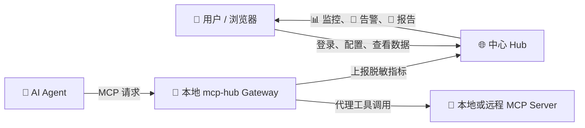

<div align="center">

#  MCP Server Hub

**MCP Server 的发现、配置、接入、监控与发布平台**

发现 · 配置 · Gateway · 监控 · 告警 · 发布

[](https://github.com/blankbrains/McpServerHub/releases/tag/v0.3.2)
[](https://www.python.org/)
[](https://fastapi.tiangolo.com/)
[](https://www.postgresql.org/)
[](https://react.dev/)
[](https://github.com/blankbrains/McpServerHub/actions/workflows/ci.yml)
[](https://opensource.org/licenses/MIT)

<br>

[产品模块](#modules) · [核心能力](#features) · [快速开始](#quick-start) · [CLI](#cli) · [部署](#deployment) · [开发](#development) · [文档](#documentation)

</div>

---

MCP Server Hub 是一个面向 MCP Server 的发现、配置、Gateway 接入、运行监控和发布平台。它由两部分组成：

- **中心 Hub**：提供网页、市场、账户、设备管理、告警、报告和聚合遥测。
- **本地 CLI/Gateway**：运行在用户自己的电脑上，代理 AI Agent 与 MCP Server 的通信，并主动上报脱敏指标。

推荐架构：



**McpServerHub 的工作方式**：用户先在中心 Hub 的网页中管理 MCP Server、设备和配置；AI Agent 运行在用户自己的电脑上，通过本地 `mcp-hub Gateway` 访问本地或远程 MCP Server。Gateway 在代理调用的同时生成脱敏遥测，并上报到中心 Hub，网页再展示监控、告警和报告。

**中心 Hub 不直接连接用户电脑，也不会观察未经过本地 Gateway 的直连调用。**

> 🔒 **隐私边界**
>
> 浏览器不会扫描用户电脑。只有经过本地 Gateway 的调用才会产生个人监控数据；Agent 直接连接 MCP Server 时，Hub 无法观察该调用。

---

## 🛡️ 管理员后台

管理员登录后可以在普通侧栏左下角进入“🛡️ 管理后台”。管理员后台与普通用户工作区分开，按平台运营目标拆分为：

| 页面 | 作用 |
|------|------|
| 📊 平台概览 | 用户、设备、在线 Gateway、Server 和累计调用摘要 |
| 👥 用户与设备 | 账号活跃度、设备接入、Gateway 在线状态和用户详情 |
| 📦 Server 与市场 | Server 市场数据、安全等级、市场可见性和上下架 |
| 📈 平台分析 | 全平台调用、Token、活跃用户和活跃 Server 趋势 |
| ✅ 接入验证 | 自愿参与者的匿名接入漏斗和验证结果汇总 |
| 🛡️ 内容审核 | 用户评价列表和删除操作 |
| 📋 操作审计 | 管理员角色修改、评价删除、Server 操作记录 |

管理员看到的是平台级聚合数据和脱敏接入状态。后台不会展示用户设备令牌、本地配置原文、环境变量、请求头、工具请求正文或响应正文。

管理员统计优先使用 `telemetry_events` 中的 `tool_call`，并排除带 `source_event_id` 的兼容 `usage_stats` 行，避免现代 Gateway 事件被重复计算。没有关联事件 ID 的历史统计仍会保留。

管理员页面支持桌面侧栏和移动端抽屉导航；用户与 Server 列表支持搜索、筛选、键盘进入详情和 CSV 导出。角色管理禁止当前管理员自我降级，并保证平台始终至少保留一名管理员。管理员操作审计与普通通知严格分离，不进入普通通知列表或未读角标。

---

## 🏷️ 当前版本

- 当前稳定版本：`0.3.2`
- 稳定安装入口：GitHub Tag `v0.3.2`
- PyPI 发布状态：暂缓，**不要使用 PyPI 安装命令**
- `main` 只作为测试通道，不保证与生产环境兼容

---

<a id="modules"></a>

## 🧭 产品模块

网页左侧按工作目标拆分为以下入口：

| 模块 | 用途 |
|------|------|
| 🏠 **概览** | 查看账户状态、近期运行摘要和市场推荐 |
| 🔎 **发现 MCP** | 搜索、筛选、对比、收藏和查看 MCP Server |
| 📦 **我的 MCP** | 管理个人追踪列表、状态、收藏和配置冲突 |
| ⚙️ **配置** | 上传、检查、追踪和导出 Agent 配置 |
| 💻 **设备** | 管理本地 Agent 设备令牌和 Gateway 接入 |
| 📊 **监控** | 查看本地 Server 运行状态和监控摘要 |
| 🔔 **告警** | 查看、处理和调整 Gateway、Server 与配置告警 |
| 📄 **报告** | 导出当前账户的聚合遥测报告 |
| 🚀 **发布** | 创建、编辑、审核和发布 MCP Server |

设备模块内部包含：

- 设备与接入
- 本地清单

监控模块内部包含：

- 运行监控
- 调用分析
- 用户验证

> 🔔 告警在左侧独立入口中保留。左下角的“通知”入口也会保留，并显示当前未读数量；处理通知后数量会立即同步。

---

<a id="features"></a>

## ✨ 核心能力

### 🏪 市场与社区

- 搜索、筛选、排序和查看 MCP Server。
- 查看安全状态、版本、许可证、来源和兼容性。
- 对比多个 Server。
- 收藏、评分、评价和查看热门/高评分条目。
- 发布和维护自己的 MCP Server。

### 📦 个人配置与追踪

- 保存当前账户的 MCP Server 追踪关系。
- 从市场条目或本地配置加入追踪列表。
- 批量启用、停用和移除追踪项。
- 查看市场状态、Gateway 状态、运行状态、真实调用状态、配置一致性和安全状态。
- 管理配置草稿、方案市场和多 Agent 配置导出。

### 🔌 本地 Gateway

- 支持迁移可安全代理的 stdio、Streamable HTTP 和 SSE Server。
- 保留 Server 的 `args`、`env`、请求头和工作目录。
- 在本地保存迁移备份和 `migration-manifest.json`。
- 支持断开、恢复、诊断、版本检查和队列重试。
- 本地 Agent 令牌只用于遥测上报，不能作为网页登录凭证。

### 📊 监控与报告

Gateway 可上报以下聚合指标：

- 设备在线状态和最后心跳。
- Server 运行状态、启动时间和生命周期。
- 工具调用次数、成功率和错误次数。
- 平均延迟、P95 延迟和调用趋势。
- 工具、Server 和 MCP 协议操作统计。
- CPU、内存和进程运行时长采样。
- 队列积压、传输字节数和估算 Token。

报告只包含聚合指标，不包含原始请求、响应或凭证。

### 🔔 告警

告警按账户、设备和 Server 范围聚合，避免同一问题重复刷屏。当前覆盖：

- Gateway 离线。
- 设备令牌撤销。
- Gateway 版本不兼容。
- Server 连续初始化失败。
- 工具错误率过高。
- P95 延迟过高。
- 遥测队列积压。
- 多设备配置指纹冲突。

告警状态包括：

- **处理中**：当前条件仍存在，需要处理。
- **已恢复**：条件已经消失，历史记录保留。
- **已暂停**：用户暂停了对应规则，当前告警不会继续提醒。

查看活动告警会标记为已读并从默认待处理列表移除。忽略活动告警会保留状态，直到问题恢复；恢复后才允许新的异常重新提醒。

### 🛡️ 本地发现与隐私

本地清单只展示已授权设备主动上报的脱敏摘要。不会上传或展示：

- 工具请求正文和响应正文。
- 设备令牌、JWT 和 OAuth 凭证。
- 环境变量值。
- 请求头值。
- 完整命令、参数和工作目录中的敏感内容。
- 本地配置文件的完整内容。

Token 指标根据工具定义或 MCP 调用载荷估算，不等同于模型供应商账单。

### 🖥️ 自托管进程管理

Hub 主机上的 MCP Server 进程管理默认关闭。只有明确配置：

```text
MCP_HUB_ALLOW_SERVER_PROCESS_MANAGEMENT=true
```

并由受信任管理员使用时，才可启用安装、启动、停止、重启、更新和日志操作。普通用户的个人追踪、Gateway 监控和自托管 Hub 主机进程管理是不同边界。

---

<a id="quick-start"></a>

## 🚀 快速开始：连接现有 Hub

这是普通用户最短的接入路径。它只在用户自己的电脑安装 CLI/Gateway，不会安装或修改远程 Hub。

### 1. 📥 安装 uv 和 mcp-hub CLI

Windows PowerShell：

```powershell
powershell -ExecutionPolicy ByPass -c "irm https://astral.sh/uv/install.ps1 | iex"
```

macOS/Linux：

```bash
curl -LsSf https://astral.sh/uv/install.sh | sh
```

安装稳定版本：

```bash
uv tool install --force "git+https://github.com/blankbrains/McpServerHub.git@v0.3.2"
uv tool update-shell
```

关闭并重新打开终端后验证：

```bash
mcp-hub --version
mcp-hub --help
```

`uv tool install` 只在当前电脑安装 CLI 和本地 Gateway，不会修改远程 Hub、GitHub 仓库或项目源码。当前终端所在目录或磁盘不会决定 uv 的安装位置。

如果需要把 Windows 工具、命令入口、缓存和 uv 管理的 Python 放到 D 盘，请先设置：

```powershell
[Environment]::SetEnvironmentVariable("UV_TOOL_DIR", "D:\uv\tools", "User")
[Environment]::SetEnvironmentVariable("UV_TOOL_BIN_DIR", "D:\uv\bin", "User")
[Environment]::SetEnvironmentVariable("UV_CACHE_DIR", "D:\uv\cache", "User")
[Environment]::SetEnvironmentVariable("UV_PYTHON_INSTALL_DIR", "D:\uv\python", "User")
```

重开终端后检查：

```powershell
uv tool dir
uv tool dir --bin
uv python dir
where.exe mcp-hub
mcp-hub --version
```

卸载：

```powershell
uv tool list --show-paths
uv tool uninstall mcp-hub-cli
where.exe mcp-hub
```

不要把“在 D 盘目录执行命令”解释为“安装到 D 盘”；工具位置由 uv 环境变量决定。完整 Windows 安装说明见[安装与部署指南](deploy/install.md)。

### 2. 🌐 检查 Hub 网络

```bash
curl "http://<Hub地址>:3987/api/v1/health"
```

响应中的 `status` 应为 `healthy`。如果无法访问，检查 Hub 地址、端口、防火墙、VPN 和局域网连通性。

### 3. 🔑 登录网页并创建设备

1. 在网页完成 GitHub 登录。
2. 打开左侧“设备”。
3. 进入“设备与接入”。
4. 为实际使用的 Agent 创建独立设备。
5. 复制页面显示的一次性接入命令。

设备令牌只显示一次。不要截图、提交到 Git、写入公开文档或发送给他人。令牌泄露后应立即在网页撤销并重新创建。

### 4. 🔎 确认 Agent 已经有 MCP Server

`agent setup` 负责迁移已有连接，不会替你创建第一个 MCP Server。目标 Agent 至少需要一个可用的 stdio、Streamable HTTP 或 SSE Server。

常见配置位置：

| Agent | 常见配置路径 |
|------|-------------|
| Codex | `~/.codex/config.toml` |
| Claude Code | `~/.claude.json`、`~/.claude/mcp.json`、项目 `.mcp.json` |
| Claude Desktop | `Claude/claude_desktop_config.json` |
| Cursor | `~/.cursor/mcp.json` |
| Windsurf | `~/.codeium/windsurf/mcp_config.json` |
| VS Code Copilot | 项目 `.vscode/mcp.json` |
| Trae | `~/.trae/mcp.json` |

网页配置检查目前只支持根节点包含 `mcpServers` 对象的 JSON。Codex TOML、根节点为 `servers` 的 JSON 和复杂多 Agent 配置请使用 CLI。

### 5. 🔌 执行接入命令并完全重启 Agent

示例：

```bash
mcp-hub agent setup \
  --agent codex \
  --hub-url http://<Hub地址>:3987 \
  --telemetry-token mcpht_<设备令牌>
```

CLI 会在确认后：

1. 备份原 Agent 配置。
2. 写入独立的 Gateway 配置。
3. 用 `mcp-hub serve` 替换可安全迁移的直接连接。
4. 保留无法迁移的条目。
5. 上报脱敏清单和运行指标。

完成后必须**完全重启 Agent**：退出目标 Agent 的所有进程，再重新打开。仅关闭对话、刷新窗口或重新加载页面通常不够。

### 6. ✅ 触发真实调用并验证

让 Agent 实际调用一次已经经过 Gateway 的 MCP 工具，再打开网页“监控”或“调用分析”刷新。

只有真实工具调用会产生 `tool_call` 数据。普通对话、只打开工具列表，以及未经过本地 Gateway 的直接连接也不会被监控。

首选诊断命令：

```bash
mcp-hub agent verify --agent codex
mcp-hub agent verify --agent codex --json
mcp-hub agent status --agent codex
mcp-hub agent doctor --agent codex
```

`agent verify` 会检查 Agent 入口、Gateway 配置、命令和 cwd、本地遥测队列、Hub 网络、设备令牌、Gateway 心跳和首次真实工具调用。默认只读；只有显式执行 `--fix` 并确认预览后才会修改可安全判定的本地状态。

### 7. 🔄 后续同步追踪列表

网页调整“我的 MCP”后，在本地同步 Gateway：

```bash
mcp-hub config sync --agent codex --server http://<Hub地址>:3987
```

同步只更新 Gateway 管理清单，写入前会确认并备份，保留本地环境变量、请求头和工作目录。同步后需要重启 Agent。

---

<a id="cli"></a>

## ⌨️ CLI 常用命令

### 🔎 市场与社区

```bash
mcp-hub search database
mcp-hub info <server-id>
mcp-hub compare <server-a> <server-b>
mcp-hub trending
mcp-hub top-rated
mcp-hub favorite <server-id>
mcp-hub favorites
mcp-hub rate <server-id> 5
mcp-hub review <server-id> "你的评价"
```

### 🔌 Agent 与 Gateway

```bash
mcp-hub agent setup --agent codex --hub-url <url> --telemetry-token <token>
mcp-hub agent verify --agent codex
mcp-hub agent backups --agent codex
mcp-hub agent disconnect --agent codex
mcp-hub agent restore --agent codex
mcp-hub agent status --agent codex
mcp-hub agent doctor --agent codex
mcp-hub config sync --agent codex --server <url>
mcp-hub self check --hub-url <url>
mcp-hub self upgrade
mcp-hub self rollback
```

`self rollback` 只接受稳定的 `v<major>.<minor>.<patch>` Tag，不能回滚到 `main`。

### 🌍 Official MCP Registry

```bash
mcp-hub registry-sync --source official
```

该命令增量同步公开 Registry 元数据。上游删除只会隐藏公共市场条目，不会删除用户追踪、收藏、评价、遥测或历史记录。官方来源标记不等同于 Hub 的安全审批。

对于远程 `streamable-http` 和 SSE 条目，使用生成的结构化 MCP 配置。Hub 不猜测本地 `npx`、`pip` 或其他启动命令，也不保存或导出请求头、Token、认证值、URL 模板变量或上游原始载荷。

### 🖥️ 本地 Hub 和自托管 Server

```bash
# 本机快速启动，使用 SQLite
mcp-hub quickstart

# 只有显式启用 Hub 主机进程管理后才使用
mcp-hub install <server-id>
mcp-hub start <server-id>
mcp-hub stop <server-id>
mcp-hub restart <server-id>
mcp-hub status
mcp-hub logs <server-id> -f
```

运行 `mcp-hub --help` 或 `mcp-hub <command> --help` 查看完整参数。

---

## ⚡ 本机 Quickstart

Quickstart 适合个人本机验证，使用 SQLite 并只监听 `127.0.0.1`。从源码构建前端后安装：

```bash
git clone https://github.com/blankbrains/McpServerHub.git
cd McpServerHub

cd src/mcp_hub/web
npm ci
npm run build
cd ../../..

uv tool install --force .
mcp-hub quickstart
```

打开：

```text
http://localhost:3987
```

Quickstart 配置目录为 `~/.config/mcp-hub/`，默认使用：

```text
~/.config/mcp-hub/.env
~/.config/mcp-hub/mcp-hub.db
```

需要 GitHub 登录时配置真实 OAuth：

```text
MCP_HUB_GITHUB_CLIENT_ID
MCP_HUB_GITHUB_CLIENT_SECRET
MCP_HUB_GITHUB_REDIRECT_URI
```

直接从 GitHub URL 安装 CLI 时，未跟踪的 `web/static` 不会进入安装包；这种方式适合连接已有 Hub，不适合启动完整网页 Hub。

---

<a id="deployment"></a>

## 🐳 Docker Compose 部署

Docker Compose 会启动 PostgreSQL 和 Hub。先准备 `.env`，至少包含：

```text
POSTGRES_PASSWORD=change-this-password
MCP_HUB_SECRET=change-this-secret
MCP_HUB_GITHUB_CLIENT_ID=your-github-oauth-client-id
MCP_HUB_GITHUB_CLIENT_SECRET=your-github-oauth-client-secret
MCP_HUB_GITHUB_REDIRECT_URI=http://<Hub地址>:3987/api/v1/auth/callback
```

启动和检查：

```bash
docker compose up -d --build
docker compose ps
curl http://localhost:3987/api/v1/health
```

停止：

```bash
docker compose down
```

生产部署中的环境变量、数据库密码和 OAuth Secret 只应放在未提交的环境文件或秘密管理系统中。不要把 `.env`、Token 或真实凭证提交到 Git。

---

## ⚙️ systemd 部署

仓库提供：

- `deploy/mcp-hub.service`
- `deploy/mcp-hub.env.example`
- `deploy/install.sh`

典型流程：

```bash
sudo install -d -m 0750 /etc/mcp-hub
sudo install -m 0600 deploy/mcp-hub.env.example /etc/mcp-hub/mcp-hub.env
sudo install -m 0644 deploy/mcp-hub.service /etc/systemd/system/mcp-hub.service

# 编辑环境文件后：
sudo systemctl daemon-reload
sudo systemctl enable --now mcp-hub
sudo systemctl status mcp-hub
sudo journalctl -u mcp-hub -n 100 --no-pager
curl http://localhost:3987/api/v1/health
```

字符串形式的 Uvicorn 启动必须使用应用工厂：

```text
mcp_hub.api.app:create_app --factory
```

不要把生产环境的 `.env`、数据库连接串、JWT Secret 或 GitHub OAuth Secret 放进仓库。完整部署、Windows 路径、Gateway 接入、排障、Docker 和 systemd 说明见[安装与部署指南](deploy/install.md)。

---

## 🛡️ 关键边界

| 项目 | 实际行为 |
|------|----------|
| 追踪 Server | 保存当前账户与 Server 的关系，不会远程安装或启动用户电脑上的进程 |
| 原生配置导出 | Agent 直接连接 Server，不经过 Gateway，因此没有 Hub 调用监控 |
| Gateway 监控 | 记录脱敏指标，不上传原始请求、响应、凭证或完整命令 |
| Token | 根据工具定义或 MCP 调用载荷估算，不等同于模型供应商账单 |
| 网页配置上传 | 只解析根节点为 `mcpServers` 的 JSON；TOML 和 `servers` JSON 使用 CLI 迁移 |
| 设备令牌 | 只用于遥测上报，不能作为网页登录凭证 |
| 告警 | 基于脱敏摘要聚合，查看会标记已读，忽略活动告警会持续隐藏直到恢复 |
| 自托管进程管理 | 默认关闭，只适用于可信 Hub 主机上的管理员 |

---

## 🩺 API 和健康检查

默认 API 前缀：

```text
/api/v1
```

健康检查：

```bash
curl http://localhost:3987/api/v1/health
```

应用工厂：

```text
mcp_hub.api.app:create_app
```

生产默认端口为 `3987`。PostgreSQL 用于生产，SQLite 适合 Quickstart 和测试。

---

<a id="development"></a>

## 🛠️ 开发

要求：

- Python 3.10+
- Node.js 22+
- PostgreSQL 16+，或测试/Quickstart 使用 SQLite

安装开发依赖：

```bash
git clone https://github.com/blankbrains/McpServerHub.git
cd McpServerHub
python -m venv .venv

# Linux/macOS
source .venv/bin/activate

# Windows PowerShell
# .\.venv\Scripts\Activate.ps1

python -m pip install -e ".[dev]"

cd src/mcp_hub/web
npm ci
cd ../../..
```

应用运行所需环境变量：

```text
MCP_HUB_DATABASE_URL
MCP_HUB_SECRET
MCP_HUB_GITHUB_CLIENT_ID
MCP_HUB_GITHUB_CLIENT_SECRET
```

从 `.env.example` 创建本地配置，但不要提交 `.env`、真实 Token、密码或服务器信息。

验证：

```bash
ruff check src tests
mypy src
pytest tests/
```

前端：

```bash
cd src/mcp_hub/web
npm audit --audit-level=high --registry=https://registry.npmjs.org
npm run build
cd ../../..
```

构建 Python 分发包：

```bash
python -m pip install build twine
python -m build
python -m twine check --strict dist/*
```

代码边界：

- API 路由：`src/mcp_hub/api/`
- 核心服务：`src/mcp_hub/core/`
- 数据模型和数据库：`src/mcp_hub/db/`
- CLI：`src/mcp_hub/cli/`
- React 前端：`src/mcp_hub/web/`
- 部署合同：`Dockerfile`、`docker-compose.yml`、`deploy/`

每个确认的 Bug 都应包含回归测试。不要通过删除断言、降低检查级别或吞掉异常来让测试通过。

---

<a id="documentation"></a>

## 📚 文档

- [安装与部署指南](deploy/install.md)：CLI 安装、Gateway 接入、排障、Docker 和 systemd。
- [AI Agent 安装说明](deploy/install-skillhub.md)：供自动化代理执行的最小安全流程。
- [贡献指南](CONTRIBUTING.md)：开发环境、检查命令和 Pull Request 要求。

---

## 🤝 贡献

提交代码前请阅读[贡献指南](CONTRIBUTING.md)。Pull Request 应说明：

- 行为变化和影响范围。
- 新增或更新的回归测试。
- `pytest`、Ruff、Mypy 和前端构建结果。
- 仍存在的限制或风险。

提交前检查是否包含 `.env`、凭证、计划文档或本地运维信息。

---

## 📄 许可证

MIT © 2026 McpServerHub

---

<div align="center">
  <sub>为开放、可观测且可控的 MCP 生态而构建</sub>
</div>
